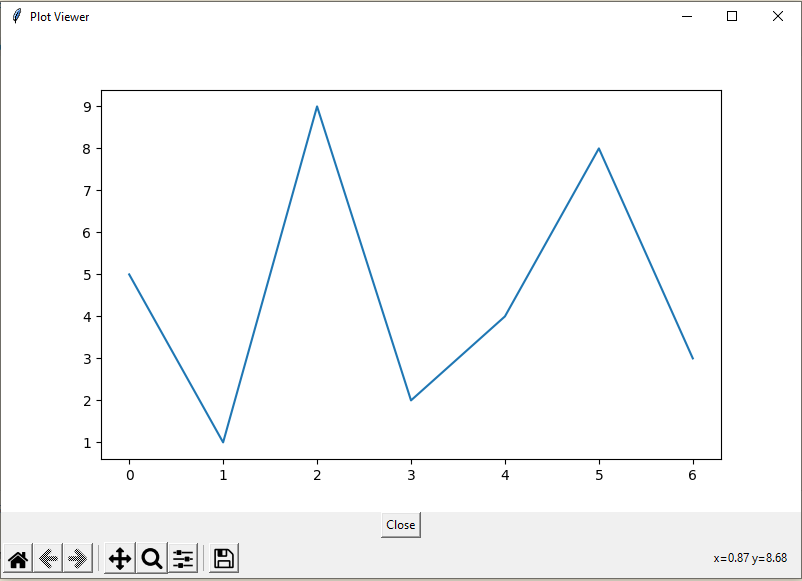

# PlotViewer

Helper to visualizer graph from [Matplotlib](https://matplotlib.org/) using [Tkinter](https://docs.python.org/3/library/tkinter.html) as GUI

## Installation

Download the project and run:

```bash
python pip install .
```

## Usage

```python
from matplotlib.figure import Figure
import plotviewer.plotviewer as pv

fig = Figure()
fig.add_subplot(111).plot([5,1,9,2,4,8,3])

pv.show(fig)
```

Resulting in:


For now, PlotViewer works only with object **matplotlib.figure.Figure**

## Based-on
[Embedding Matplotlib in TK](https://matplotlib.org/3.1.0/gallery/user_interfaces/embedding_in_tk_sgskip.html)